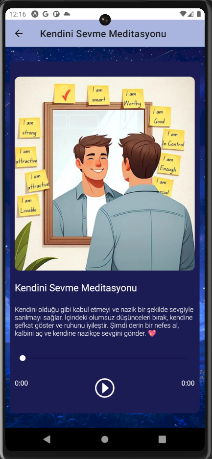

🧘‍♀️ Meditation App - React Native & Expo AV
Bu proje, React Native ve Expo AV kullanarak geliştirilen bir meditasyon uygulamasıdır. Kullanıcılar farklı kategorilerde meditasyon sesleri dinleyebilir ve rahatlatıcı bir deneyim yaşayabilir. 🌿✨

🚀 Özellikler
✅ Çeşitli meditasyon kategorileri (Odaklanma, Uyku, Rahatlama)
✅ Expo AV ile kesintisiz ses oynatma
✅ Modern ve kullanıcı dostu arayüz

  
  

